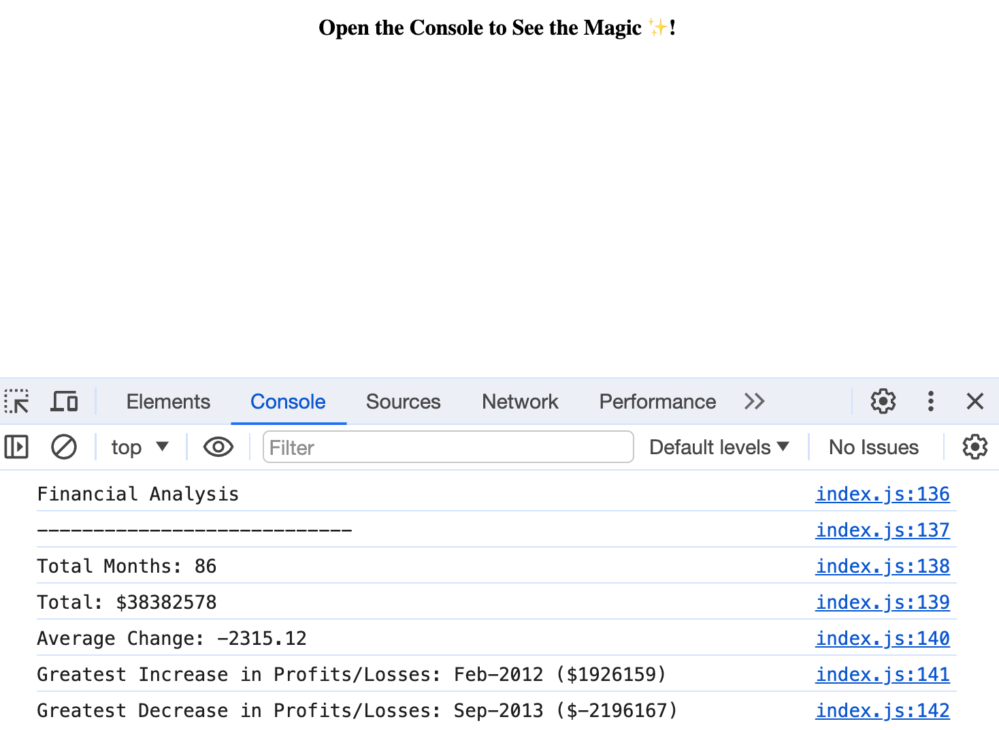

# Console Finances

## Description

The project represents an analysis of a company's financial records. It includes:
- Total number of months included in the dataset
- Net total amount of Profit/Losses over the entire period
- Average of the **changes** in Profit/Losses over the entire period.
- Greatest increase in profits (date and difference in the amounts) over the entire period.
- Greatest decrease in losses (date and difference in the amounts) over the entire period.

## Usage

The view the results of the analysis, please right click on the page, and tap on "Inspect" to open the console.

## Credits

The project was built following the instructions from the materials in the Skills Bootcamp in Front-End Web Development by edX.

In addition, the following resources were used:
1. W3School Article: [Best Practices for writing JavaScript](https://www.w3schools.com/js/js_best_practices.asp)
2. freeCodeCamp Article: [JavaScript 2D Array](https://www.freecodecamp.org/news/javascript-2d-arrays/)
3. YouTube tutorial: [JavaScript for Beginners #30 - Two Dimensional Arrays Part 2](https://www.youtube.com/watch?v=ajSXu2D2gzg)
4. [Shields.io](https://shields.io/) for badges

## License

This project is licensed under the terms of the MIT license.

## Badges

